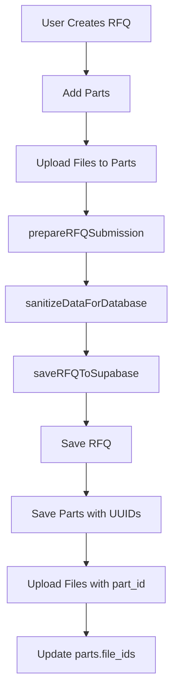
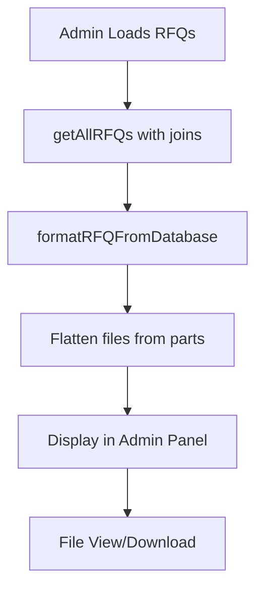

# RFQ System Documentation

**Last Updated:** June 27, 2025  
**Purpose:** Comprehensive documentation of RFQ, Parts, and Attachments system to prevent data relationship issues

---

## 📋 Table of Contents

1. [Database Schema](#database-schema)
2. [Data Relationships](#data-relationships)
3. [Key Classes & Files](#key-classes--files)
4. [Critical Functions](#critical-functions)
5. [Data Flow Process](#data-flow-process)
6. [Common Pitfalls & Solutions](#common-pitfalls--solutions)
7. [Testing & Verification](#testing--verification)

---

## 🗄️ Database Schema

### Core Tables

#### `rfqs` Table
```sql
CREATE TABLE rfqs (
    id UUID DEFAULT uuid_generate_v4() PRIMARY KEY,
    rfq_number TEXT UNIQUE NOT NULL,
    customer_id UUID REFERENCES customers(id),
    customer_info JSONB,
    title TEXT NOT NULL,                    -- ⚠️ REQUIRED FIELD
    description TEXT,
    requirements TEXT,
    status TEXT DEFAULT 'new',
    priority TEXT DEFAULT 'normal',
    requested_delivery DATE,
    quote_due_date DATE,
    total_parts INTEGER DEFAULT 0,
    total_quantity INTEGER DEFAULT 0,
    services JSONB DEFAULT '[]'::jsonb,     -- Available services
    materials JSONB DEFAULT '[]'::jsonb,    -- Available materials
    surface_finishes JSONB DEFAULT '[]'::jsonb, -- Available finishes
    tolerances TEXT,                        -- Tolerance requirements
    special_requirements TEXT,              -- Special manufacturing requirements
    estimated_value NUMERIC DEFAULT 0,     -- ⚠️ NUMERIC not DECIMAL
    actual_value NUMERIC DEFAULT 0,        -- Final quoted value
    margin NUMERIC DEFAULT 0,              -- Profit margin
    source TEXT DEFAULT 'web_form',
    assigned_to TEXT DEFAULT 'unassigned', -- Who is handling this RFQ
    tags JSONB DEFAULT '[]'::jsonb,         -- Categorization tags
    notes JSONB DEFAULT '[]'::jsonb,        -- Internal notes array
    timeline JSONB DEFAULT '[]'::jsonb,     -- Status change timeline
    quotes JSONB DEFAULT '[]'::jsonb,       -- Generated quotes
    created_at TIMESTAMP WITH TIME ZONE DEFAULT timezone('utc'::text, now()) NOT NULL,
    updated_at TIMESTAMP WITH TIME ZONE DEFAULT timezone('utc'::text, now()) NOT NULL,
    submitted_at TIMESTAMP WITH TIME ZONE,
    reviewed_at TIMESTAMP WITH TIME ZONE,   -- When RFQ was reviewed
    quoted_at TIMESTAMP WITH TIME ZONE,     -- When quote was generated
    closed_at TIMESTAMP WITH TIME ZONE,     -- When RFQ was closed
    email_data JSONB                        -- Email metadata for tracking
);

-- ⚠️ CRITICAL CONSTRAINTS
ALTER TABLE rfqs ADD CONSTRAINT rfqs_rfq_number_unique UNIQUE (rfq_number);
CREATE INDEX idx_rfqs_status ON rfqs(status);
CREATE INDEX idx_rfqs_customer_id ON rfqs(customer_id);
CREATE INDEX idx_rfqs_created_at ON rfqs(created_at);
```

#### `parts` Table
```sql
CREATE TABLE parts (
    id UUID DEFAULT uuid_generate_v4() PRIMARY KEY,
    rfq_id UUID NOT NULL REFERENCES rfqs(id) ON DELETE CASCADE,
    name TEXT NOT NULL,
    part_number TEXT,                    -- ⚠️ CRITICAL: Added in migration
    quantity INTEGER DEFAULT 1,
    material TEXT,
    surface_finish TEXT,
    description TEXT,
    specifications JSONB DEFAULT '{}'::jsonb,
    file_ids JSONB DEFAULT '[]'::jsonb,  -- ⚠️ Array of file UUIDs
    estimated_value DECIMAL(12,2) DEFAULT 0,
    status TEXT DEFAULT 'new',
    created_at TIMESTAMP WITH TIME ZONE DEFAULT NOW(),
    updated_at TIMESTAMP WITH TIME ZONE DEFAULT NOW()
);
```

#### `files` Table
```sql
CREATE TABLE files (
    id UUID DEFAULT uuid_generate_v4() PRIMARY KEY,
    rfq_id UUID NOT NULL REFERENCES rfqs(id) ON DELETE CASCADE,
    part_id UUID REFERENCES parts(id) ON DELETE CASCADE,  -- ⚠️ CRITICAL: Links files to parts
    filename TEXT NOT NULL,
    file_path TEXT NOT NULL,
    file_size BIGINT,
    content_type TEXT,
    uploaded_at TIMESTAMP WITH TIME ZONE DEFAULT NOW()
);

-- ⚠️ CRITICAL INDEXES
CREATE INDEX idx_files_rfq_id ON files(rfq_id);
CREATE INDEX idx_files_part_id ON files(part_id);  -- Essential for performance
```

### Helper View
```sql
CREATE OR REPLACE VIEW files_with_parts AS
SELECT 
    f.id,
    f.rfq_id,
    f.part_id,
    f.filename,
    f.file_path,
    f.file_size,
    f.content_type,
    f.uploaded_at,
    p.name as part_name,
    p.part_number,
    r.rfq_number
FROM files f
LEFT JOIN parts p ON f.part_id = p.id
LEFT JOIN rfqs r ON f.rfq_id = r.id;
```

---

## 🔗 Data Relationships

### Primary Relationships
```
RFQ (1) → (Many) Parts → (Many) Files
    ↓
Customer (1) → (Many) RFQs
```

### Key Constraints
- **Files MUST have both `rfq_id` AND `part_id`**
- **Parts.file_ids array MUST match actual files.part_id**
- **All IDs MUST be valid UUIDs**

### Data Integrity Rules
1. **Files belong to exactly one Part and one RFQ**
2. **Parts.file_ids is maintained MANUALLY via application code and migration scripts**
3. **When a Part is deleted, its Files are cascade deleted (via FK constraint)**
4. **When an RFQ is deleted, all Parts and Files are cascade deleted (via FK constraints)**
5. **File integrity must be manually verified and repaired using provided maintenance commands**

---

## 📁 Key Classes & Files

### Frontend Classes

#### `RFQPanelSystem` (js/rfq-panel-system.js)
**Primary Role:** Handle RFQ creation, part management, file uploads
**Key Responsibilities:**
- Manage RFQ/part/file data in browser storage
- Prepare submission data with proper UUID relationships
- Handle file uploads and metadata

#### `SupabaseDataManager` (js/core/SupabaseDataManager.js)  
**Primary Role:** Database operations and data formatting
**Key Responsibilities:**
- Execute Supabase queries with proper joins
- Format data between frontend and database schemas
- Handle file uploads to Supabase storage
- Maintain data consistency

#### `AdminDashboard` (js/core/AdminDashboard.js)
**Primary Role:** Display and manage RFQs in admin interface
**Key Responsibilities:**
- Load and display RFQ data with nested parts/files
- Provide file viewing and downloading functionality
- Handle RFQ status updates

---

## ⚙️ Critical Functions

### RFQ Submission Pipeline

#### 1. `prepareRFQSubmission()` (RFQPanelSystem)
```javascript
// ⚠️ CRITICAL: Sets file.partId for each file
const fileData = {
    id: fileRef.id,
    name: storedFile.metadata.name,
    size: storedFile.metadata.size,
    type: storedFile.metadata.type,
    partId: part.id,  // 🔥 ESSENTIAL for file-part linking
    partNumber: part.number,
    data: await this.fileToBase64(storedFile.file)  // Convert to base64 for transmission
};
```

#### 2. `sanitizeDataForDatabase()` (RFQPanelSystem)
```javascript
// ⚠️ CRITICAL: Must update BOTH file.id AND file.partId
if (data.files) {
    data.files.forEach(file => {
        if (file.id) {
            file.id = ensureValidUUID(file.id, 'file');
        }
        if (file.partId) {
            file.partId = ensureValidUUID(file.partId, 'part');  // 🔥 ESSENTIAL
        }
    });
}
```

#### 3. `saveRFQToSupabase()` (RFQPanelSystem)
```javascript
// Creates UUID mapping for parts
const partIdMapping = {};
for (const part of submissionData.parts) {
    const partUUID = part.id.startsWith('PART-') ? this.generateUUID() : part.id;
    partIdMapping[part.id] = partUUID;
}

// Uses mapping to link files to parts
const partId = partIdMapping[file.partId];  // 🔥 DEPENDS ON sanitizeDataForDatabase
await this.dataManager.uploadFile(fileToUpload, rfqUUID, file.id, partId);
```

#### 4. `saveParts()` (SupabaseDataManager)
```javascript
// ⚠️ CRITICAL: Correct field mapping with fallback logic
async saveParts(parts, rfqId) {
    const partsData = parts.map(part => ({
        id: part.id,
        rfq_id: rfqId,
        name: part.name,
        part_number: part.part_number || part.number || part.partNumber,  // 🔥 MULTIPLE FALLBACKS
        quantity: part.quantity,
        material: part.material,
        surface_finish: part.finish || part.surface_finish || part.surfaceFinish,  // 🔥 CORRECT FIELD NAME
        description: part.description,
        specifications: part.specifications,
        file_ids: part.fileIds || part.file_ids || [],  // 🔥 CORRECT FIELD NAME & FALLBACK
        estimated_value: part.estimatedValue || part.estimated_value,
        status: part.status
    }));

    const { error } = await this.client
        .from(SUPABASE_CONFIG.tables.parts)
        .upsert(partsData);

    if (error) throw error;
    return true;
}
```

### Database Operations

#### 5. `getAllRFQs()` (SupabaseDataManager)
```javascript
// ⚠️ CRITICAL: Proper join syntax for nested files
.select(`
    *,
    parts (
        *,
        files!files_part_id_fkey (*)  // 🔥 Must use foreign key syntax
    )
`)
```

#### 6. `formatRFQFromDatabase()` (SupabaseDataManager)
```javascript
// ⚠️ CRITICAL: Properly format ALL fields from database
formatRFQFromDatabase(dbRFQ) {
    const parts = (dbRFQ.parts || []).map(part => ({
        ...part,
        files: part.files || []
    }));
    const allFiles = parts.flatMap(p => p.files || []);

    return {
        // Core fields
        id: dbRFQ.id,
        rfqNumber: dbRFQ.rfq_number,
        customerId: dbRFQ.customer_id,
        customerInfo: dbRFQ.customer_info,
        customer: dbRFQ.customer_info || { name: null, email: null, company: null },
        title: dbRFQ.title,
        description: dbRFQ.description,
        requirements: dbRFQ.requirements,
        status: dbRFQ.status,
        priority: dbRFQ.priority,
        requestedDelivery: dbRFQ.requested_delivery,
        quoteDueDate: dbRFQ.quote_due_date,
        
        // Part and file relationships
        parts: parts,
        files: allFiles,  // 🔥 Flattened for admin panel display
        
        // Counts and values
        totalParts: dbRFQ.total_parts,
        totalQuantity: dbRFQ.total_quantity,
        estimatedValue: dbRFQ.estimated_value,
        actualValue: dbRFQ.actual_value,        // 🔥 ACTUAL IMPLEMENTATION
        margin: dbRFQ.margin,                   // 🔥 ACTUAL IMPLEMENTATION
        
        // Manufacturing requirements
        services: dbRFQ.services,               // 🔥 ACTUAL IMPLEMENTATION
        materials: dbRFQ.materials,             // 🔥 ACTUAL IMPLEMENTATION
        surfaceFinishes: dbRFQ.surface_finishes, // 🔥 ACTUAL IMPLEMENTATION
        tolerances: dbRFQ.tolerances,           // 🔥 ACTUAL IMPLEMENTATION
        specialRequirements: dbRFQ.special_requirements, // 🔥 ACTUAL IMPLEMENTATION
        
        // Workflow fields
        source: dbRFQ.source,
        assignedTo: dbRFQ.assigned_to,          // 🔥 ACTUAL IMPLEMENTATION
        tags: dbRFQ.tags,                       // 🔥 ACTUAL IMPLEMENTATION
        notes: dbRFQ.notes,
        timeline: dbRFQ.timeline,
        quotes: dbRFQ.quotes,                   // 🔥 ACTUAL IMPLEMENTATION
        
        // Timestamps
        createdAt: dbRFQ.created_at,
        updatedAt: dbRFQ.updated_at,
        submittedAt: dbRFQ.submitted_at,
        reviewedAt: dbRFQ.reviewed_at,          // 🔥 ACTUAL IMPLEMENTATION
        quotedAt: dbRFQ.quoted_at,              // 🔥 ACTUAL IMPLEMENTATION
        closedAt: dbRFQ.closed_at,              // 🔥 ACTUAL IMPLEMENTATION
        emailData: dbRFQ.email_data             // 🔥 ACTUAL IMPLEMENTATION
    };
}
```

#### 7. `uploadFile()` (SupabaseDataManager)
```javascript
// ⚠️ CRITICAL: Must save metadata with part_id
const metadata = {
    id: fileId,
    rfq_id: rfqId,
    part_id: partId,  // 🔥 ESSENTIAL for file-part relationship
    filename: file.name,
    file_path: filePath,
    file_size: file.size,
    content_type: file.type,
    uploaded_at: new Date().toISOString()
};
await this.saveFileMetadata(metadata);
```

---

## 🔄 Data Flow Process

### RFQ Submission Flow



### Admin Panel Display Flow



---

## ⚠️ Common Pitfalls & Solutions

### 1. **Files Missing part_id**
**Symptom:** Files uploaded but not showing in admin panel
**Cause:** `file.partId` not properly sanitized before submission
**Solution:** Ensure `sanitizeDataForDatabase()` updates `file.partId`

### 2. **Part.file_ids Out of Sync**
**Symptom:** Parts show wrong file count
**Cause:** `parts.file_ids` array not updated after file operations
**Solution:** Run sync migration:
```sql
UPDATE parts 
SET file_ids = (
    SELECT COALESCE(jsonb_agg(f.id), '[]'::jsonb)
    FROM files f WHERE f.part_id = parts.id
);
```

### 3. **Supabase Query Join Errors**
**Symptom:** Files not loaded in queries
**Cause:** Incorrect join syntax in Supabase queries
**Solution:** Use foreign key syntax: `files!files_part_id_fkey (*)`

### 4. **UUID vs Old-Style ID Conflicts**
**Symptom:** `partIdMapping[file.partId]` returns undefined
**Cause:** File partId references not converted to UUIDs
**Solution:** Ensure all ID sanitization happens before mapping

### 5. **Missing Database Constraints**
**Symptom:** Data integrity issues
**Cause:** Missing foreign key constraints
**Solution:** Ensure proper FK constraints and indexes exist

---

## 🧪 Testing & Verification

### Database Integrity Checks

#### 1. Verify File-Part Relationships
```sql
-- Check for orphaned files (missing part_id)
SELECT COUNT(*) as orphaned_files 
FROM files 
WHERE part_id IS NULL;

-- Check for files with invalid part_id references
SELECT COUNT(*) as invalid_part_references 
FROM files f 
LEFT JOIN parts p ON f.part_id = p.id 
WHERE f.part_id IS NOT NULL AND p.id IS NULL;

-- Check for RFQ-Part relationship mismatches
SELECT COUNT(*) as mismatched_rfq_ids
FROM files f
JOIN parts p ON f.part_id = p.id
WHERE f.rfq_id != p.rfq_id;

-- All queries should return 0
```

#### 2. Verify Parts.file_ids Sync
```sql
-- Check parts with mismatched file_ids
SELECT 
    p.id,
    p.name,
    p.file_ids,
    COALESCE(jsonb_agg(f.id), '[]'::jsonb) as actual_files
FROM parts p
LEFT JOIN files f ON p.id = f.part_id
GROUP BY p.id, p.name, p.file_ids
HAVING p.file_ids != COALESCE(jsonb_agg(f.id), '[]'::jsonb);

-- Should return no rows
```

#### 3. Verify RFQ-File Consistency
```sql
-- Check for files with mismatched rfq_id
SELECT f.*, p.rfq_id as part_rfq_id
FROM files f
JOIN parts p ON f.part_id = p.id
WHERE f.rfq_id != p.rfq_id;

-- Should return no rows
```

### Frontend Testing

#### 1. Test RFQ Submission
1. Create RFQ with multiple parts
2. Upload files to different parts
3. Submit RFQ
4. Verify in database that all files have `part_id`

#### 2. Test Admin Panel Display
1. Load RFQs in admin panel
2. Verify files show under correct parts
3. Test file viewing/downloading

---

## 🔧 Maintenance Commands

### Regular Maintenance

#### Sync File Relationships (run after bulk operations)
```sql
-- Update parts.file_ids to match actual files
UPDATE parts 
SET file_ids = (
    SELECT COALESCE(jsonb_agg(f.id), '[]'::jsonb)
    FROM files f 
    WHERE f.part_id = parts.id
);
```

#### Fix Orphaned Files (emergency repair)
```sql
-- Link orphaned files to first part of their RFQ
UPDATE files 
SET part_id = (
    SELECT p.id 
    FROM parts p 
    WHERE p.rfq_id = files.rfq_id 
    ORDER BY p.created_at ASC 
    LIMIT 1
)
WHERE part_id IS NULL;
```

---

## 📝 Change Log

### 2025-06-27: Major Schema & Logic Fixes
- **Added:** `part_number` field to parts table
- **Fixed:** `sanitizeDataForDatabase()` to handle `file.partId`
- **Updated:** Supabase queries to use proper join syntax
- **Added:** File viewer and download functionality in admin panel
- **Implemented:** Comprehensive data integrity checks

### Critical Lessons Learned
1. **Always sanitize ALL ID references**, not just primary IDs
2. **Maintain bidirectional relationships** (parts.file_ids ↔ files.part_id)
3. **Use proper Supabase join syntax** for nested queries
4. **Test data integrity** after any schema changes
5. **Document ID mapping processes** thoroughly

---

## 🚨 Emergency Procedures

### If Files Don't Show in Admin Panel
1. **Run Complete Integrity Check:**
   ```sql
   -- Check all relationship issues
   SELECT COUNT(*) as orphaned_files FROM files WHERE part_id IS NULL;
   SELECT COUNT(*) as invalid_references FROM files f LEFT JOIN parts p ON f.part_id = p.id WHERE f.part_id IS NOT NULL AND p.id IS NULL;
   SELECT COUNT(*) as mismatched_rfqs FROM files f JOIN parts p ON f.part_id = p.id WHERE f.rfq_id != p.rfq_id;
   ```
2. **If any issues found, run repair migration:**
   ```sql
   -- Link orphaned files and sync file_ids
   UPDATE files SET part_id = (SELECT p.id FROM parts p WHERE p.rfq_id = files.rfq_id ORDER BY p.created_at ASC LIMIT 1) WHERE part_id IS NULL;
   UPDATE parts SET file_ids = (SELECT COALESCE(jsonb_agg(f.id), '[]'::jsonb) FROM files f WHERE f.part_id = parts.id);
   ```
3. **Verify Supabase query syntax:** `files!files_part_id_fkey (*)`
4. **Check frontend formatting:** Ensure `formatRFQFromDatabase()` flattens files correctly

### If New Submissions Fail
1. **Check browser console for errors:**
   - UUID conversion failures in `sanitizeDataForDatabase()`
   - File upload errors in network tab
   - PartIdMapping lookup failures
2. **Verify data flow:**
   ```javascript
   // Ensure file.partId is set in prepareRFQSubmission()
   // Ensure file.partId is sanitized in sanitizeDataForDatabase()  
   // Ensure partIdMapping[file.partId] succeeds in saveRFQToSupabase()
   ```
3. **Test specific components:**
   - File upload to IndexedDB storage
   - Part ID generation and mapping
   - Supabase file metadata save
4. **Check database after submission:**
   ```sql
   SELECT rfq_number, COUNT(p.id) as parts, COUNT(f.id) as files
   FROM rfqs r
   LEFT JOIN parts p ON r.id = p.rfq_id  
   LEFT JOIN files f ON p.id = f.part_id
   WHERE r.created_at > NOW() - INTERVAL '1 hour'
   GROUP BY r.id, rfq_number;
   ```

### If Data Corruption Detected
1. **Stop all RFQ submissions immediately**
2. **Run full integrity assessment:**
   ```sql
   -- Complete system health check
   SELECT 'orphaned_files' as issue, COUNT(*) as count FROM files WHERE part_id IS NULL
   UNION ALL
   SELECT 'invalid_part_refs', COUNT(*) FROM files f LEFT JOIN parts p ON f.part_id = p.id WHERE f.part_id IS NOT NULL AND p.id IS NULL
   UNION ALL  
   SELECT 'mismatched_rfqs', COUNT(*) FROM files f JOIN parts p ON f.part_id = p.id WHERE f.rfq_id != p.rfq_id
   UNION ALL
   SELECT 'parts_missing_files', COUNT(*) FROM parts p WHERE jsonb_array_length(p.file_ids) != (SELECT COUNT(*) FROM files f WHERE f.part_id = p.id);
   ```
3. **Create data backup before any repairs**
4. **Apply repairs in order:** orphans → invalid refs → mismatched IDs → sync file_ids
5. **Re-test complete RFQ flow** before resuming normal operations

---

**⚠️ REMEMBER:** Always test changes with a complete RFQ submission flow: Create → Add Parts → Upload Files → Submit → Verify in Admin Panel